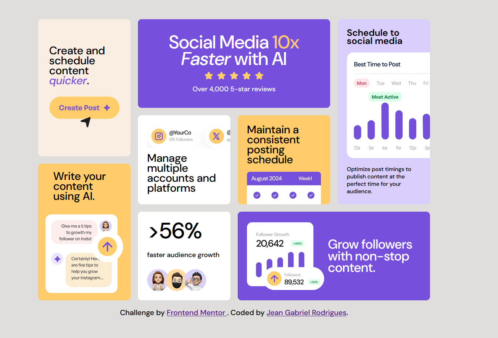
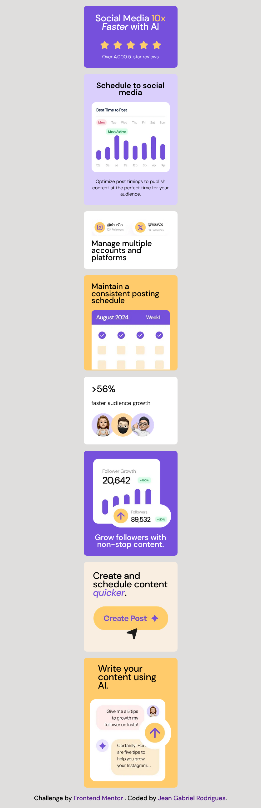

# FrontEnd Mentor Challenge

# Bento Grid Challenge

Esse challenge do Front-End Mentor é voltado para o treinamento de Tecnologias como _HTML_ e _CSS_, utilizando Display Flex, Display Grid, Position Absolute e Position Relative, para um design mais responsivo.

Foi utilizado Media Queries, onde foi realizado primeiramente a estilização da página para dispositivos Desktop, após isso é realizado a estilização para dispositivos Mobile.

Poderá visualizar nesse <a target="_blank" href="https://thejrodrigues.github.io/Bento-Grid-Challenge/">LINK</a>
  
  

# Desktop

  
  

# Mobile

